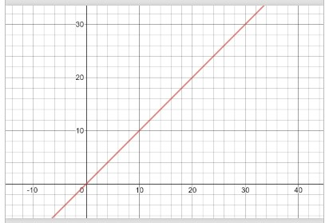

# Python Data Structure

---

Welcome to the Python Data Structure Tutorial. Every Student of Python learning
should understand the basics of these topics:

\*[Stack](1-stack.md)

\*[Set](2-set.md)

\*[Tree](3-tree.md)

Each module will contain examples and descriptions. At the end of each topic you will find a problem to solve on your own. Look at the solution to your problem after you have attempted to solve first.

## Big O Notation

To evaluate code and look for alternative solutions, it is important that we have a common method for quantifying the **performance** of code in terms of time. The principles we will learn can also be applied to analysis of how much memory or space is used by code to perform a task.

## BIG O NOTATION AND LINEAR PERFORMANCE

**Big O** notation is used to describe the performance of an **algorithm** _(or function)_ for large sets of data. If we have two functions that do the same thing, we can use big O notation to compare the performance of the two functions. As a simple example, consider the following code which looks for the name "vanessa" in a list of names:

```
def find_vanessa(name_list):
	for name in name_list:
		if name == "vanessa":
			return True
	return False
```

The size of the data in this function is based on the size of the **name_list**. We will say that size of the data is **n**. The **for** loop in the code means that we will potentially run **n** times. This worst case potential will only happen if "vanessa" is not in the list of names. Therefore, we say that the big O in the worst case is O(n). In general, when we ask for the big O of a function we are asking for the worst case scenario. This function does have a best case scenario. If "vanessa" is the first name in the list, then the loop will only run one time. Therefore, we can say the big O in the best case is O(1). We call O(1) **constant** time. When looking at code, usually a single line of code like an assignment statement, is considered O(1).

If a function has O(n) performance, then we also say that the function has linear performance. Using a graphing calculator or a graphing website (e.g. [desmos.com](https://www.desmos.com/calculator)), we can visually see the **linear** performance of O(n). The graph below shows y = x which is used to represent O(n). When x (or n) gets bigger, the amount of work (y) gets larger in a linear way.


| Function             | Description                                                                                                                                                                                                                                                                                                                                                                                                                                                                                                                                                                                                                         | Performance                                         |     |
| -------------------- | ----------------------------------------------------------------------------------------------------------------------------------------------------------------------------------------------------------------------------------------------------------------------------------------------------------------------------------------------------------------------------------------------------------------------------------------------------------------------------------------------------------------------------------------------------------------------------------------------------------------------------------- | --------------------------------------------------- | --- |
| lookup(index)        | Performance of getting a value in the dynamic array using the index. Since the dynamic array is in contiguous memory, the equation address = starting_address + (item_size \* index) can be used to get the value in a dynamic array using the index quickly.                                                                                                                                                                                                                                                                                                                                                                       | O(1)                                                |     |
| append(value)        | Performance of adding to the end of dynamic array. If the dynamic array is not full yet, then the cost is based on the lookup operation to go to the next open space. If the dynamic array is full, then we need to create new memory which is twice the size and then copy the old memory. This is an O(n) operation because of the loop required. However, for large values of n, this copy doesn't happen very often. We can amortize (or spread out) the cost of the O(n) loop on all the previous appends that were filling up the dynamic array. Therefore, we say the worst case for appending in the dynamic array is O(1). | O(1)                                                |     |
| insert(index, value) | Performance of inserting at the beginning or the middle of the dynamic array. When we insert anywhere but the end, then we will need a loop to move all the items from the index to the end over by one position. This requires a loop which in the worst case will require moving all items in the list.                                                                                                                                                                                                                                                                                                                           | O(n)                                                |     |
| remove(index)        | Performance of removing an element in the list. When we remove, we have to move all items over by one position towards the begining of the list. This requires a loop that in the worst case will require moving all items in the list. However, in the case of removing the last item in the list, there is nothing to move over. This scenario will be O(1).                                                                                                                                                                                                                                                                      | O(n) except for removing the last one which is O(1) |     |
| size()               | Performance of returning the size of the dynamic array. The class for the dynamic array data structure will keep track of how many items are currently in the list so no loop is required.                                                                                                                                                                                                                                                                                                                                                                                                                                          | O(1)                                                |
| capacity()           | Performance of returning the capacity of the dynamic array. The class for the dynamic array data structure will keep track of the capcity of the current list so no loop is required.                                                                                                                                                                                                                                                                                                                                                                                                                                               | O(1)                                                |
| empty()              | Performance of checking the size of the dynamic array                                                                                                                                                                                                                                                                                                                                                                                                                                                                                                                                                                               | O(1)                                                |

## Youtube Video About Big-O Notation

If you are a audible learner here is a Video that can help!
[Big-O Notation Video](https://www.youtube.com/watch?v=IR_S8BC8KI0)

## Contact

For questions and comments are welcome, send a message to:

Vanessa Buzzell, BYU-Idaho, CSE 212, Section 05

[vanessabuzzell20001@byui.edu](vanessabuzzell@byui.edu)
