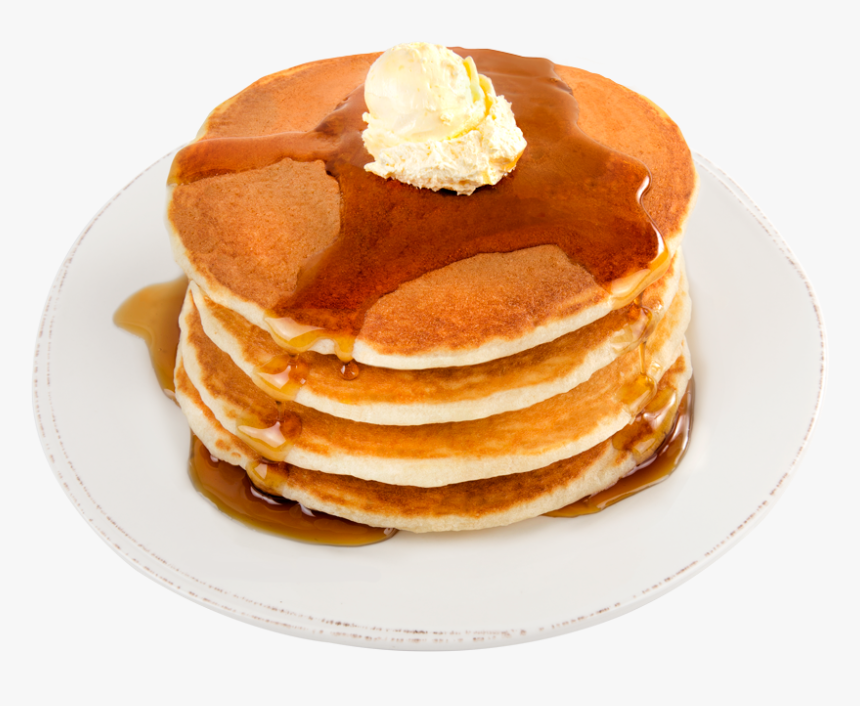
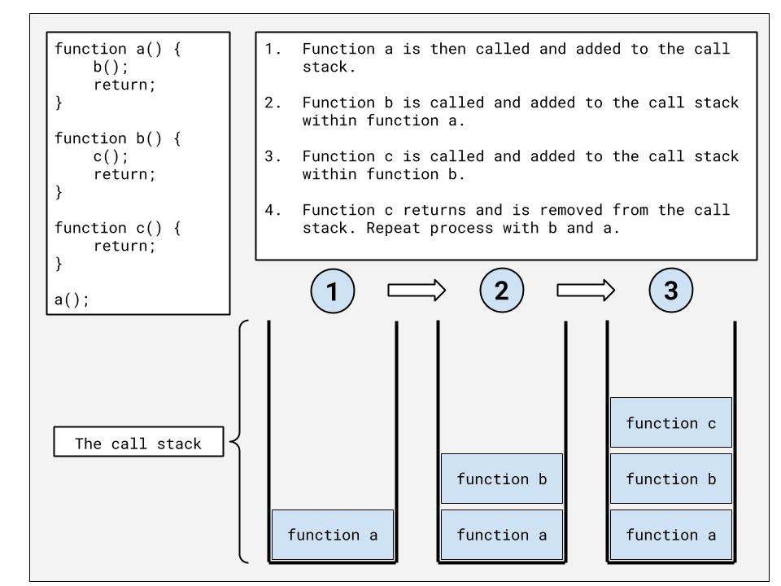
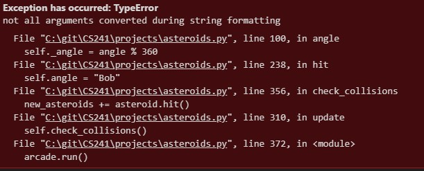
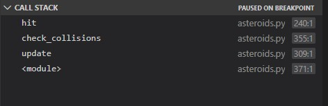

# STACKS

---

A _stack_ is a data structure that is characterized by the order in which items are added and removed. Often called **"Last In, First Out" (LIFO)**, the stack can be used to accomplish various tasks and can be implemented using a Python list.

## Applications Of Stack

Stack is known as the backbone of the Data Structure in Python. Almost all the algorithms are implemented using the Stack.

- Stack works on the LIFO principle i.e. they are used to reverse the string.
- Stack is used in Expression Evaluation and Expression Conversion.
- It is also used in web browsers for the forward and the backward features.
- It is used for syntax parsing.
- It is used for Backtracking in the searching algorithms.

## STACK OF PANCAKES

If you were going to make pancakes for your family or friends, you probably would have a plate ready to stack the hot pancakes on as they finished cooking. Each time we put a pancake onto the stack, we call this a **push** operation. In our culinary example, we might say that each new pancake goes onto the top of the stack. However, since we are going to implement our stacks in Python, we will say that the pancake is actually added to the back. When we take a pancake off to eat, we call this a **pop** operation. Notice that we **push** and **pop** from the back of the stack. Removing from the middle of the stack is not generally allowed (especially at the dinner table). Notice that the pancake at the front is the very first pancake that was cooked. If the pancakes are made faster than they are eaten, then this first pancake would get cold. A LIFO (Last In, First Out) structure like the **stack** can result in data not being used for a long time. This might not work well for a rotating stock system in a grocery store, but the real benefit of the stack is the ability to remember where we have been.



## THE "UNDO" OPTION AND THE STACK

One of the most common stacks that people use on a computer is related to the Undo option in word processors and editors. When we type something on the keyboard, the item is both displayed to the screen and also added to a stack. If we type "A B C D E F G H I", we would expect the following commands to be put pushed onto the stack: Type "A", Type "B", Type "C", and so forth. The last item to be pushed would be Type "I". If we press the Undo button, the software will pop the stack and receive: Type "I". The software will then do the opposite of this which would result in the word "I" being removed from the screen.

Since the stack is maintaining a history of what was typed, we can guarantee that pressing the Undo button will revert changes in the right order. If we popped five additional times, we would have "A B C" remaining on the screen. If we type "J K L M N", we would see five new pushes to the stack. The original first three commands to display "A B C" still remains at the front of the stack. If the Undo button is pressed enough times, then these initial words would eventually be removed.

Stacks are useful when we need to maintain history and perform an operation (eg. Undo function in an editor) backwards.

## SOFTWARE AND THE FUNCTION STACK

Even if we didn't know what a stack was before today, we have actually been using stacks in all software we have written. When we call a function in our code, we are telling the computer two things:

- Which function we want to call

- Which function to go back to when we are done

The first of these is clear in our code. If we are currently in function A, then we expect to call function B. However, how do we tell the computer that we want to return to function A when function B is finished. This can be even more complicated by the fact that function B will need to call functions C, D, and E before it can finish. The computer accomplishes this by using a function stack. When a function is called, it is pushed to the stack. The current function running is always on the back of the stack. When the function finishes, it is popped off the stack. The result is that the function to return to is the one that is on the back of the stack.



In addition to keeping track of the function name that is running, the stack also allows us to see where in the function we were when a function was originally called as well as the memory that we were using in our function. Stacks work well for remembering where we've been and the circumstances we were in during that previous time.

When using Python or other programming languages, we will often see error messages that look like the following. Notice that the information is showing which functions have called which functions up until the point of error. This display of information comes directly from the function stack.



Many code editors also include a debugger. Debuggers can be used to pause execution of software so that we can see what is occurring within our code step-by-step. Part of the debugger capability is the display of the function stack (or frequently called the call stack) when the software is paused (due to a breakpoint or an exception).



## STACKS IN PYTHON

In Python, a stack can be represented using a list. To push an item to the back of the stack, the **append** function can be used on the list. To **pop** items from the back of the stack, the pop function can be used. The **pop** function will also delete it from the list. The size can be determined by using the **len** function on the list. The performance of the stack using a Python list is based on the performance of the dynamic array.

| Common Stack Operation | Description                                              | Python Code            | Performance                                                    |
| ---------------------- | -------------------------------------------------------- | ---------------------- | -------------------------------------------------------------- |
| push(value)            | Adds "value" to the back of the stack.                   | my_stack.append(value) | O(1) - Performance of adding to the end of a dynamic array     |
| pop()                  | Removes and returns the item from the back of the stack. | value = my_stack.pop() | O(1) - Performance of removing from the end of a dynamic array |
| size()                 | Return the size of the stack.                            | length = len(my_stack) | O(1) - Performance of returning the size of the dynamic array  |
| empty()                | Returns true if the length of the stack is zero.         | if len(my_stack) == 0: | O(1) - Performance of checking the size of the dynamic array   |

## Basic Operations Of Stack

The basic operations of Stack are mentioned below:

- Push:
  It is used to insert the elements into the Stack. If the Stack is full, then the Overflow condition will occur.

- Pop:
  It is used to delete the element from the Stack. Once the Stack is empty, the Underflow condition will occur.

- Peek or Top:
  It will return the top element from the Stack.

- isEmpty:
  If the Stack is empty, then it will return TRUE as an output otherwise it will return FALSE.

## Code Examples

If you are an audible learner this youtube video will help.

[Stack Data Structures Video](https://www.youtube.com/watch?v=LDVg4m2PpTg)

# Problem To Do

### Problem 1

Here is a problem for you to try to use stack to see if you understand what it does.

```
"""
    vanessa buzzell
    CSE212
    BYU-Idaho
    Problem 1
"""

stack = []
stack.append('The')
stack.append('cat')
stack.append('went')
stack.pop()
stack.pop()
stack.append('up')
stack.append('the')
stack.pop()
stack.append('tree')
stack.append('to')
stack.append('get')
stack.append('a')
stack.pop()
stack.pop()
stack.append('mouse')
stack.pop()
stack.pop()
stack.pop()
stack.append('that')
stack.append('took')
stack.pop()
stack.pop()
stack.pop()
stack.append('a')
stack.append('slice')
stack.append('of')
stack.append('cheese')
stack.pop()
stack.pop()
stack.pop()
stack.append('to')
stack.append('feed')
stack.pop()
stack.append('the')
stack.append('squirl.')
stack.pop()
stack.pop()
print(stack)  # Can you predict what will print?
```

### Problem 2

In this problem you should look at the code and have an understanding of what it is doing. first remove the students who finished there work on time Elijah, Harper And Lorraine.
Then add new students to the that need to get there assignments to finish Mike, and Sunny.

[Problem 2](PythonFiles/stackP2.py)

# Solutions

Only look at the solution once you have tried to accomplish the problem on your own first to see how you did!

### Problem 1

Run the code to see if you were right! If you were not go back and see where you missed the code.

### Problem 2

[solution](PythonFiles/stackS2.py)

## Back to Data Structure Tutorial

[Main](0-welcome.md)
