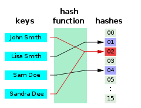
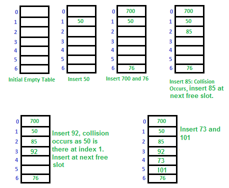

# Sets

Previously we learned about lists, stacks, and queues. The location of each item in these data structures was very important to the proper use of the data structure. Not all data structures worry about the order of the data. The **set** data structure is an example of one for which order is not important.

## Characteristics of Sets

Python also includes a data type for **sets**. A set is an unordered collection with no duplicate elements. Basic uses include membership testing and eliminating duplicate entries. Set objects also support mathematical operations like union, intersection, difference, and symmetric difference.

Curly braces or the set() function can be used to create sets. Note: to create an empty set you have to use set(), not {}; the latter creates an empty dictionary, not a empty set.

## Hashing an Sets

To achieve the O(1) time for set operations, we will consider a very simple example. Assume we wanted to store all positive one digit numbers (0 to 9) into a list. How would we store these numbers if we wanted to have an O(1) performance for adding, removing, or testing for membership? If we used the value to determine the index into the list, we might be able to achieve O(1). Consider the function index(n) = n. If we wanted to add the number 7, then we would use this simple function to determine the index to put the number 7 is index 7. If we wanted to add the number 4, then we would put it into our function and get the index 4. For this to work, our list will need to be exactly size 10.


Picture diagram from https://en.wikipedia.org/wiki/Hash_function#/media/File:Hash_table_4_1_1_0_0_1_0_LL.svg

The list above shows several one digit numbers added to our list according to the rule **_index(n) = n_**. Notice that if we wanted to know if a number existed in the list, then we would use the formula to lookup the index. This would result in an O(1) performance. Also notice that the list is not populated in the same way that we learned about dynamic arrays. We call this a **sparse** list because the list is not guaranteed to be filled from left to right.

We call this sparse list a set. Notice that there is only one place for each value to go. Therefore, the set does not allow duplicates because there would be no place for the duplicate value to be placed.

Imagine we changed this simple example to include all nine digit positive numbers (0 to 1,000). How big would the list need to be store these numbers and still achieve O(1) performance? We would need a list size of 1 Thousand. While this would work, the amount of memory is prohibitive. To store just one 4 digit number, we would need memory for a 1 Thousand sized spare list. Could we do this with something smaller such as a sparse list size of 10? We can accomplish this by using the modulo (%) operator. If we wrote the equation as index(n) = n % 100, then we would be able to store values properly. The value 938 would be placed based on index(938) = 938 % 10 = 8. The value 582 would be placed in index 2.


Picture diagram from https://en.wikipedia.org/wiki/Hash_table#/media/File:Hash_table_3_1_1_0_1_0_0_SP.svg

The equation we used above can be generalized as follows: **index(n) = n % sparse_list_size**.** This works great for numbers. We can also use equations like this for strings and floats. The generic function is i**ndex(n) = hash(n) % sparse_list_size**. The hash(n) represents what is called a \***hashing function\*\*\*. The hashing function will convert non-integers into integers so that the modulo operation can be performed. Python has a built-in hash function. The values returned by the hash function will vary everytime you run a Python script, but they will be consistent while you are running a script to completion. Not everything can be hashed. For example, a list in Python cannot be hashed. It is common to say that the index(n) is the hashing function for a set and that the values in a set have been hashed.


If we only have 100 spots and there are up to 10 billion possible values, it's reasonable to expect that perhaps there is a weakness in the data structure. Using the same diagram above, what would happen if we tried to add 548,345,952? This would also be placed in index 2. This is called a conflict.

## Dealing with Conflicts

There are two common ways to deal with conflict in a sparse list. The first option is called **open addressing**. A second option is called **chaining**.

### Open Addressing

Like separate chaining, open addressing is a method for handling collisions. In Open Addressing, all elements are stored in the hash table itself. So at any point, the size of the table must be greater than or equal to the total number of keys (Note that we can increase table size by copying old data if needed).

If we use our index(n) hashing function and find that something already occupies the space (or the item in that space is not what we are looking for), then open addressing strategy will tell us move to the next available space. There are multiple ways that this can be done, but the simplest method would be to look to the right one spot at a time. The danger with this approach is that a conflict can result in the creation of more conflicts. Let us consider a simple hash function as “key mod 7” and a sequence of keys as 50, 700, 76, 85, 92, 73, 101.


Diagram is from https://www.geeksforgeeks.org/hashing-set-3-open-addressing/

Watch this YouTube video to get more understanding.

[Open Addressing Video](https://www.youtube.com/watch?v=CwM-Cxilk4g)

### Chaining

Instead of looking for a new place for our data, we can make a list of values that occupy the same space.


Diagram from https://www.researchgate.net/figure/Hash-table-representation-for-separate-chaining_fig2_284454241

In both of these options to solve conflicts, we have an adverse effect on our O(1) performance. The use of the **index(n)** hashing function is what gives us the O(1) timing. If we have to search through several positions to find a value, or if we have to search the chained list, we may approach O(n) if the amount of conflict is high. To avoid this, we need to increase the size of the sparsed list if the amount of conflict is too high. When we increase the size of the sparsed list, then we need to reposition all of the values by running the **index(n)** function again with the increased sparsed list size.

Watch this YouTube video to get more understanding.

[Chaining Video](https://www.youtube.com/watch?v=_6IGfyI-6vM)

## Applications with Sets

### Python’s built-in set type has the following characteristics:

- Sets are unordered.
- Set elements are unique. Duplicate elements are not allowed.
- A set itself may be modified, but the elements contained in the set must be of an immutable type.
- The set does not keep values in order. This occurs because the index(n) hashing function is not based on the order the value was added.
- Fast peformance for adding, removing, and finding (membership test).

### The set has many uses including the following:

- Finding the unique values in a list.
- Providing quick access to unique results previously calculated.
- Performing mathematical set operations such as an intersection (common values between two sets) and union (all values within two sets).

## Sets in Python

Let’s see what all that means, and how you can work with sets in Python.

A set can be created in two ways. First, you can define a set with the built-in set() function:

```
x = set(<iter>)

>>> x = set([laa', 'con', 'con', 'lif', 'nex'])
>>> x
{'nex', 'lif', 'con', 'laa'}

>>> x = set(('laa', 'con', 'con', 'lif', 'nex'))
>>> x
{'nex', 'lif', 'con', 'laa'}
```

**Strings** are also iterable, so a string can be passed to set() as well. You have already seen that list(s) generates a list of the characters in the string s. Similarly, set(s) generates a set of the characters in s:

```
>>> s = 'quux'

>>> list(s)
['q', 'u', 'u', 'x']
>>> set(s)
{'x', 'u', 'q'}

```

Alternately, a set can be defined with curly braces ({}):

```
x = {<obj>, <obj>, ..., <obj>}
```

To recap:

- The argument to set() is an iterable. It generates a list of elements to be placed into the set.
- The objects in curly braces are placed into the set intact, even if they are iterable.
  Observe the difference between these two set definitions:

```
>>> {'foo'}
{'foo'}

>>> set('foo')
{'o', 'f'}

```

In Python, a set can be represented using a curly braces (e.g. **my_set = {1, 2, 3}**) To create an empty set (unlike an empty list), we use the code: **empty_set = set()**. The in operator can be used to determine membership in the set. The performance of the set is based on the performance of the hashing algorithm.

| **Common Set Operation** | **Description**                        | **Python Code**      | **Performance**                                                             |
| ------------------------ | -------------------------------------- | -------------------- | --------------------------------------------------------------------------- |
| add(value)               | Adds "value" to the set                | my_set.add(value)    | O(1) - Performance of hashing the value (assuming good conflict resolution) |
| remove(value)            | Removes the "value" from the set       | my_set.remove(value) | O(1) - Performance of hashing the value (assuming good conflict resolution) |
| member(value)            | Determines if "value" is in the set    | if value in my_set:  | O(1) - Performance of hashing the value (assuming good conflict resolution) |
| size()                   | Returns the number of items in the set | length = len(my_set) | O(1) - Performance of returning the size of the set                         |

There are also mathematical operations to perform an intersection and union between two sets. The code below demonstrates these capabilities in Python:

```
set1 = {1, 2, 3, 4, 5}
set2 = {4, 5, 6, 7, 8}

set3 = intersection(set1, set2)  # This will result in {4, 5}
set3 = set1 & set2               # Alternate way of writing an intersection

set4 = union(set1, set2)  # This will result in {1, 2, 3, 4, 5, 6, 7, 8}
set4 = set1 | set2        # Alternate way of writing a union
```

The Python library also includes a class called **dict** which stands for dictionary which is built using the set. The dictionary in Python also uses the curly brace notation. You will learn more about this later when you learn about **maps**.

This video will help if you need to learn by visualy and audible learner.

[Video On Sets](https://www.youtube.com/watch?v=-vfzvT0Fh0A&list=PL98qAXLA6afuh50qD2MdAj3ofYjZR_Phn&t=23s)

### problem 1

Your goal is to write a program that will find and display all pairs of numbers in a list that sum up to 10. No duplicates should be displayed. This could be done in O(n^2) with a loop within a loop. However, using a set, this can be done in O(n) time. You should assume that the list of numbers provided has no duplicates.
Click on the link to work on the problem number 1

[Problem 1](PythonFiles/setProblem1.py)

### Problem 1 Solution

When you are done, take a look at the **Solution** and see how you did.

[Solution 1](PythonFiles/setSolution1.py)

### problem 2

Click on the link to work on the problem number 2

[Problem 2](PythonFiles/setProblem2.py)

### Problem 2 Solution

When you are done, take a look at the **Solution** and see how you did.

[Problem 2](PythonFiles/setSolution2.py)

## Back to Data Structure Tutorial

[Main](0-welcome.md)
