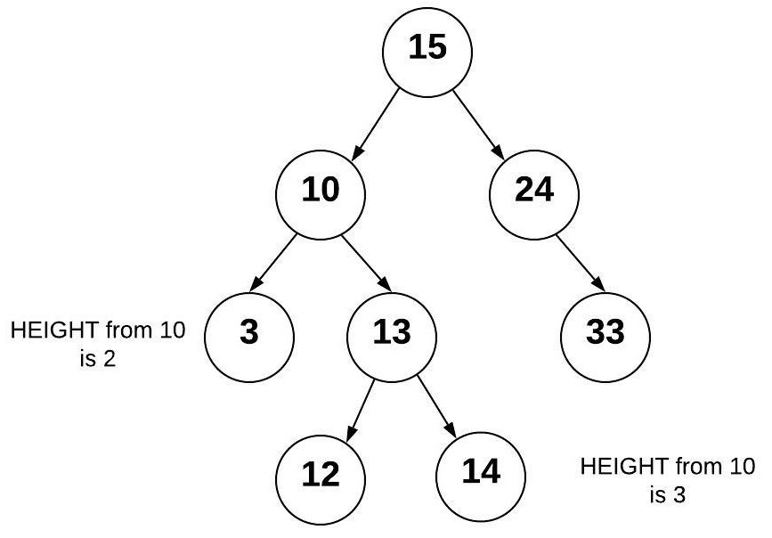

## Trees

**Trees** are like linked lists in that nodes are connected together by pointers. However, unlike linked lists, a tree can connect to multiple different nodes. We will look at the following types of trees: binary trees, binary search trees, and balanced binary search trees.

# Binary Trees

A **binary** tree is a tree that links to no more than two other **nodes**. In the picture below, the top node is called the **root** node. The nodes that connect to no other nodes are called **leaf** nodes. A node that has connected nodes is called a **parent** node. The node connected to the parent are called **child** nodes. The nodes to the left and right of any parent node form a **subtree**. There is always only one root node. While not shown in the picture, it is common for child nodes to also point back up to the parent node (similar to a linked list).


# Binary Search Trees

A **binary search tree** (BST) is a binary tree that follows rules for data that is put into the tree. Data is placed into the BST by comparing the data with the value in the parent node. If the data being added is less than the parent node, then it is put in the left subtree. If the data being added is greater than the parent node, then it is put in the right subtree. If duplicates are allowed than the duplicate can be put either to the left or to the right of the root. By using this process, the data is stored in the tree sorted.


Using the tree above, we can determine where to put additional items. We always start at the root node and compare the new value with it. We keep comparing until we have found an empty place for the new node.
For example, to find the value 3, do the following:

- Start at the root node 4 and compare with the new value 3

- Since 3 is less than 4, goto the left and visit node 2

- Since 3 is greater than 2, goto the right and see there is the number 3
  You would use the same process to add a number to the tree but you would do this process til there is empty spot.

The process that we used to find where to put the new node was an efficient process. If we had a dynamic array or a linked list containing sorted values, we would have an O(n) operation as we search for the proper location to insert a value into the proper sorted position. By using the BST, we are able to exclude a subtree with each comparison. This ability to split the job in half recursively results in O(log n). Maintaining sorted data in a BST performs better than other data structures.

However, the only reason we had O(log n) in the example above was because the tree was "balanced". To see the difference between a **balanced** and an unbalanced tree, we will construct a tree with the same values but in a different order. The reason why the previous tree has 15 as the root node is because 15 was added first. This time, we will add the values in the following order: 8, 10, 21, 28, 36,
50 (purposefully in ascending order).


This tree is a BST but looks more like a linked list. This BST is unbalanced has a resulting performance for searching of O(n) instead of O(log n).# Balanced Binary Search Trees

### Video

Here is a video to help see and hear about Binary Search Tree.

[Video on BST](https://www.youtube.com/watch?v=DlWxqU3LLpY)

# Balanced Binary Search Trees

A **balanced binary search tree** (balanced BST) is a BST such that the difference of height between any two subtrees is not dramatically different. The height of a tree can be found by counting the maximum number of nodes between root and the leaves. Since it is not reasonable to expect that the order of data will result in a balanced BST, numerous algorithms have been written to detect if a tree is unbalanced and to correct the unbalance. Common algorithms include red black trees and AVL (Adelson-Velskii and Landis) trees. The example below shows an **AVL tree** which is balanced because the difference of height between subtrees is less than 2.


If we add 13 to the right of the 12, we end up with an unbalanced AVL tree because the height of the right subtree from 10 is now 2 more than the left subtree.


The AVL algorithm will detect that the tree has become unbalanced. To balance the tree, a node rotation will be performed. For our tree, we can rotate the node with 13 so that nodes 12 and 14 are children nodes of the 13. When this rotation is done, the tree returns to a balanced state. An AVL tree will always be a Balanced BST and therefore benefit from O(log n) performance.



### Video

Here is a video to help see and hear about AVL Trees!
[Video on AVL Trees](https://www.youtube.com/watch?v=c7d5qS7RQpA)

# Inserting into a BST

Inserting into a BST is a recursive operations:

- Smaller problem: Insert a value into either the left subtree or the right subtree based on the value.

- Base case: If there is space to add the node (the subtree is empty), then the correct place has been found and the item can be inserted.
  The code for inserting into a BST is shown below. Some things to note are as follows:

- A node is defined as an object (in this example) of class **BST.Node**. This is similar to what we saw with the linked list class. The **Node** class is called an inner class because it's defined inside the **BST** class. The Node class contains three things: **data**(the value), **left** (pointer to the left node), and **right** (pointer to the right node).

- There are two functions. The insert function is the one called by the user who wants to insert a value into the tree. This function is used to call the recursive function \_insert starting at the root node. As a special case, if the root node is empty (none), then we will put the new node in the root without using any recursion. We will follow this pattern for many of the recursive functions we write for the BST.

- In the \_insert function, we should identify the base case and the recursive calls to the correct subtrees.

```
def insert(self, data):
	"""
	Insert 'data' into the BST.  If the BST
	is empty, then set the root equal to the new
	node.  Otherwise, use _insert to recursively
	find the location to insert.
	"""
	if self.root is None:
		self.root = BST.Node(data)
	else:
		self._insert(data, self.root)  # Start at the root

def _insert(self, data, node):
	"""
	This function will look for a place to insert a node
	with 'data' inside of it.  The current subtree is
	represented by 'node'.  This function is intended to be
	called the first time by the insert function.
	"""
	if data < node.data:
		# The data belongs on the left side.
		if node.left is None:
			# We found an empty spot
			node.left = BST.Node(data)
		else:
			# Need to keep looking.  Call _insert
			# recursively on the left subtree.
			self._insert(data, node.left)
	elif data >= node.data:
		# The data belongs on the right side.
		if node.right is None:
			# We found an empty spot
			node.right = BST.Node(data)
		else:
			# Need to keep looking.  Call _insert
			# recursively on the right subtree.
			self._insert(data, node.right)
```

### Video

[Video on Inserting into BST](https://www.youtube.com/watch?v=DlWxqU3LLpY)

# Traversing a BST

We **traverse** a BST when we want to display all the data in the tree. An in-order traversal will visit each node from smallest to largest. A similair process can be followed to visit each node from the largest to the smallest. This is also a recursive process:

- Smaller problem: Traverse the left subtree of a node, use the current node, and then traverse the right subtree of the node.

- Base case: If the subtree is empty, then don't recursively traverse or use anything.

The code for traversing a BST is shown below. In addition to the observations made to the insert code above, we should note the following additional things about this algorithm:

- The starting function is called **iter**. The use of double underscores in Python means that this function is part of the Python framework. When we write code like **for item in collection**, the **iter** function is called on the **collection** to get the next item. In our case, the **iter** will provide the user the next value in the BST. We call this a generator function.

- The **yield** command is used to provide the next value to the **for** loop. The **yield** is like a **return** statement in a function. However, unlike a **return**, the **yield** will allow the function to start back where it left off in the function when **iter** is called again. If we want delegate the **yield** operation to another function, the command is modified to be **yield from**. If a generator function (e.g. **iter**) needs to call another function which will **yield** the result, then we will need to use the **yield from** keywords.

```
def __iter__(self):
	"""
    Perform a forward traversal (in order traversal) starting from
    the root of the BST.  This is called a generator function.
    This function is called when a loop	is performed:

	for value in my_bst:
		print(value)

	"""
	yield from self._traverse_forward(self.root)  # Start at the root

def _traverse_forward(self, node):
	"""
	Does a forward traversal (in-order traversal) through the
	BST.  If the node that we are given (which is the current
	subtree) exists, then we will keep traversing on the left
	side (thus getting the smaller numbers first), then we will
	provide the data in the current node, and finally we will
	traverse on the right side (thus getting the larger numbers last).

	The use of the 'yield' will allow this function to support loops
	like:

	for value in my_bst:
		print(value)

    The keyword 'yield' will return the value for the 'for' loop to
    use.  When the 'for' loop wants to get the next value, the code in
    this function will start back up where the last 'yield' returned a
    value.  The keyword 'yield from' is used when our generator function
    needs to call another function for which a `yield` will be called.
    In other words, the `yield` is delegated by the generator function
    to another function.

	This function is intended to be called the first time by
	the __iter__ function.
	"""
	if node is not None:
		yield from self._traverse_forward(node.left)
		yield node.data
		yield from self._traverse_forward(node.right)
```

A reverse traversal is frequently associated with the **reversed** function in Python.

We just create a Node class and add assign a value to the node. This becomes tree with only a root node.

```
Example
class Node:
   def __init__(self, data):
      self.left = None
      self.right = None
      self.data = data
   def PrintTree(self):
      print(self.data)

root = Node(10)
root.PrintTree()
```

To insert into a tree we use the same node class created above and add a insert class to it. The insert class compares the value of the node to the parent node and decides to add it as a left node or a right node. Finally the PrintTree class is used to print the tree.

```
class Node:
   def __init__(self, data):
      self.left = None
      self.right = None
      self.data = data

   def insert(self, data):
# Compare the new value with the parent node
      if self.data:
         if data < self.data:
            if self.left is None:
               self.left = Node(data)
            else:
               self.left.insert(data)
            elif data > self.data:
               if self.right is None:
                  self.right = Node(data)
               else:
                  self.right.insert(data)
      else:
         self.data = data

# Print the tree
   def PrintTree(self):
      if self.left:
         self.left.PrintTree()
      print( self.data),
      if self.right:
         self.right.PrintTree()

# Use the insert method to add nodes
root = Node(12)
root.insert(6)
root.insert(14)
root.insert(3)
root.PrintTree()
```

# BST in Python

With The Problems that you are going to do in this tutorial for the BST class. Python does not have a built-in BST class. However, there are packages that can be installed from other developers such as bintrees that provides implementations of the BST.The table below shows the common functions in a BST.

| Common BST Operation | Description                                                                                     | Performance                                                                                                                              |
| -------------------- | ----------------------------------------------------------------------------------------------- | ---------------------------------------------------------------------------------------------------------------------------------------- |
| insert(value)        | Insert a value into the tree.                                                                   | O(log n) - Recursively search the subtrees to find the next available spot                                                               |
| remove(value)        | Remove a value from the tree.                                                                   | O(log n) - Recursively search the subtrees to find the value and then remove it. This will require some cleanup of the adjacent nodes.   |
| contains(value)      | Determine if a value is in the tree.                                                            | O(log n) - Recursively search the subtrees to find the value.                                                                            |
| traverse_forward     | Visit all objects from smallest to largest.                                                     | O(n) - Recursively traverse the left subtree and then the right subtree.                                                                 |
| traverse_reverse     | Visit all objects from largest to smallest.                                                     | O(n) - Recursively traverse the right subtree and then the left subtree.                                                                 |
| height(node)         | Determine the height of a node. If the height of the tree is needed, the root node is provided. | O(n) - Recursively find the height of the left and right subtrees and then return the maximum height (plus one to account for the root). |
| size()               | Return the size of the BST.                                                                     | O(1) - The size is maintained within the BST class.                                                                                      |
| empty()              | Returns true if the root node is empty. This can also be done by checking the size for 0.       | O(1) - The comparison of the root node or the size.                                                                                      |

# Problem

- Problem
  [Problem ](PythonFiles/treeP1.py)

When you finish the problem you will need to look at the solution and compare your results!

# Solution

## Only look at the solution after you have tried to work the problem

- Solution
  [Solution ](PythonFiles/treeS2.py)

## Back to Data Structure Tutorial

[Main](0-welcome.md)
